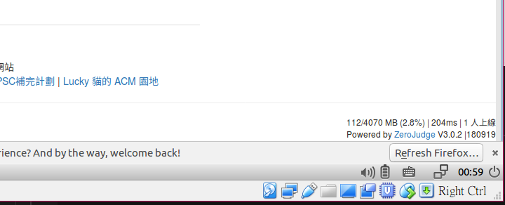

# ZeroJudge 安裝及設定

## 1.請先下載  [ZeroJudge虛擬機](https://drive.google.com/file/d/1Y-PW031lYHOuxqQUe3rjL2B8ePEGyRuC/view)

    系統資訊：
    OS: Ubuntu Desktop 18.04
    OS 預設帳密: zero / !@34ZeroJudge
    DB 預設帳密: root / !@34ZeroJudge  
    ZeroJudge 預設帳密: zero / !@#$zerojudge
    
    更改 DB 密碼:
    mysqladmin -uroot -p'!@34ZeroJudge' password 'YOUR_NEW_PASSWD'
    
    更改完後應再次執行「一行升級」以便更新資料庫相關設定。

## 2.「一行升級」 ZeroJudge 版本

    sudo python3 /home/zero/ZeroJudge/setup.py install --dbpass 'YOUR_DB_PASSWORD'

>  
>
> 查看右下角版本資訊是否正確升級。

> ### 請注意: 若您當初抓的 VM 版本是較早的版本，或升級出現錯誤訊息，您可能需要更新安裝程式。
> 刪除原有的安裝程式  
    rm -rf ZeroJudge  
> 抓新的安裝程式回來  
    git clone https://github.com/jiangsir/ZeroJudge
>

### 說明：

本計劃藉由將 ZeroJudge.tw 打包為一個虛擬機，將一切必要的設定均事先完成，讓使用者的安裝困難度降到最低，以方便更多人使用。並且藉由公開的題目交換格式使得題目可以更容易的互相流通。本系統適合用於程式教學以及 APCS 實作以及各種程式競賽，目前支援 C, C++, JAVA, Pascal, Python 等主要語言。

### 系統特色：

https://zerojudge.tw 公開上線(2007)已逾 10 年時間，由高師大附中 jiangsir 於2006年為進行程式教育而開發，是國內自主開發最早的 Online Judge 系統之一，也是目前國內最大的 Online Judge，已經評分超過 400 萬筆程式碼。過去的程式教育面臨著幾個顯著的問題，其一為教學時人力改作業必須耗費大量時間，並且容易出錯，也不精準。其次就是若是學生自學，做完題目也難以知道是否完全正確，必須借助國外類似系統，但語言隔閡又提高了學習門檻。ZeroJudge 具備了自動評分以及原生的中文系統，因而改變程式教育的面貌。本系統主要是著重於「學習」，因此許多錯誤訊息都儘可能提供最詳盡的資訊，不像部分以競賽為導向的系統，錯誤訊息過於精簡，不利學習者發現錯誤。另外，系統設計為不依賴外網資源，可以獨立於封閉環境內進行測驗、競賽，是程式教育的好幫手。

### 運作原理：

ZeroJudge 是一個 Online Judge 系統，Online Judge 系統顧名思義就是線上自動評分，使用者將自己的程式碼上傳到系統內，系統就可以幫忙判斷出這個程式是否正確，而且評分的結果是有權威性的，而非僅供參考，因此程式競賽的評審多半「不是人」。但對於同一個問題，程式的寫法有百百種，又要如何準確判斷是否正確呢？這就是軟體工程裡的「單元測試」的一種延伸運用，或稱為 TDD(Test-Driven Development, 測試驅動開發)。真正開始動手寫程式之前，就先設計 Test case(測試資料)，等到程式設計完成通過 Test case 並且在時限及記憶體要求內完成，就視為正確。

虛擬機安裝:
ZeroJudge 虛擬機下載後為一 .ova 檔，請準備好 Virtual Box 並進行匯入。

 
勾選 【重新初始化所有網路卡的MAC位址】

 
由於打包虛擬機的環境跟您的環境肯定不一樣, 因此必須變更網路設定

 
設定為橋接介面卡即可

 
登入系統之後, 點開瀏覽器即可看到系統已順利運行。

---

### 使用方式：

請先進入虛擬機桌面系統，打開瀏覽器即可看到 http://127.0.0.1 ，即一個空的全新的 ZeroJudge 。

接下來請進入「解題動態」，檢查是否有 5 個 submissions 分別是五個不同的語言對 「a001. 哈囉」的解題，應為 AC。代表評分機也運作正常。

### 解除封印

首先，ZeroJudge 虛擬機預設密碼是公開的，因此，製作虛擬機之初，就考慮到，如果假設架起來，卻沒有適當的修改密碼，或許很迅速的就會被入侵了。因此預設值限制了一些使用範圍，若想開放則必須自行更改設定進行開放。

第一：ssh 連線，預設只有本機可以連線。
sudo nano /etc/hosts.allow
比如: 可以加入 163.32.92.0/24

第二：ZeroJudge 系統本身的管理權限。
預設: zero 這個身分就是管理者，但只有本機可以登入。
如果想要在外部電腦登入管理員，請在虛擬機內登入系統之後，進入「管理系統參數」，【允許管理員登入的子網域】設定管理者可以登入的網路範圍。

 

最後，如果您只在本機進行管理，上兩項設定不動也不影響使用。

### 匯入題庫

感謝板橋高中郭兆平老師慷慨提供【板橋高中教學題】題庫，供大家自由使用，放置於本儲存庫 [problems](problems/) 資料夾檔中，共 42 個題目。

以管理員身分登入 ZeroJudge 系統, 於下拉選單【管理題目】-> 匯入題目 題目可多選，一次可匯入許多題目。

